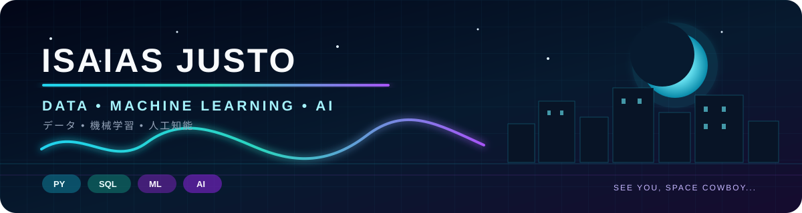

<p align="center">
  
</p>

# Olá, eu sou Isaias Justo 👋

### Data Scientist | Machine Learning | Analytics Engineering | Data Products

Transformo dados em decisões, produtos analíticos e sistemas de Machine Learning compreensíveis, rastreáveis e úteis para o negócio.

[](https://www.linkedin.com/in/isaias-justo-a8b998185/)
[](https://isaiasjusto.github.io)
[](mailto:isaiasj2906@gmail.com)

---

## Sobre mim

Atuo profissionalmente com **dados, Business Intelligence, automação e soluções analíticas**, conectando necessidades de negócio a produtos confiáveis e acionáveis.

Minha atuação combina:

- análise e visualização com Power BI;
- engenharia e processamento de dados com SQL, Microsoft Fabric e PySpark;
- automação e observabilidade de ambientes analíticos;
- Machine Learning aplicado a churn, crédito, NLP e análise de fraude;
- construção de soluções end-to-end, da ingestão à experiência do usuário;
- explicabilidade, validação, rastreabilidade e governança de IA.

Nos projetos públicos, busco demonstrar não apenas modelos, mas também **arquitetura, qualidade de dados, decisão de negócio, serving, aplicações e limites responsáveis de uso**.

---

<p align="center">
  
</p>

# Projetos selecionados

## 1. [FinPulse AI](https://github.com/isaiasjusto/finpulse-ai) — plataforma end-to-end

Meu projeto mais completo: uma plataforma para **previsão de churn bancário, explicabilidade e retenção governada**.

```text
MinIO → PostgreSQL → dbt → CatBoost → MLflow
      → Batch Scoring → FastAPI → SHAP
      → Streamlit → Ollama / Llama → Revisão humana
```

### Resultados e entregas

- **10.127 clientes** processados e pontuados;
- benchmark de dez algoritmos e **CatBoost champion v3**;
- **ROC AUC 0,9934**, **Average Precision 0,9699** e **F1-score 0,9206** no teste reservado;
- previsões persistidas no PostgreSQL e snapshot Parquet no MinIO;
- transformação e testes de dados com dbt;
- rastreabilidade de experimentos, artefatos e modelo com MLflow;
- explicabilidade global e individual com SHAP;
- API com FastAPI e dashboard multipágina em Streamlit;
- Cliente 360 com recomendação de retenção gerada por IA local;
- catálogo determinístico de ações e política obrigatória para casos prioritários;
- bloqueio de atributos pessoais não acionáveis no contexto operacional;
- saída estruturada com Pydantic e revisão humana obrigatória;
- **37 testes automatizados** na suíte da API.

**Demonstra:** Engenharia de Dados, Analytics Engineering, Machine Learning, MLOps, APIs, explicabilidade, IA generativa e governança.

---

<p align="center">
  
</p>

## 2. [Modelo de Aprovação de Crédito](https://github.com/isaiasjusto/credit-approval-risk-model) — decisão orientada a custo

Projeto de ciência de dados voltado à aprovação de crédito, com foco em **prevenção de leakage, generalização e impacto financeiro da decisão**.

### Resultados e entregas

- EDA organizada em cinco etapas;
- benchmark com Logistic Regression, Gradient Boosting, Random Forest, XGBoost e LightGBM;
- cenário limpo sem variáveis que antecipavam o desfecho;
- **XGBoost** como modelo final;
- **ROC AUC aproximado de 0,97** e **PR AUC aproximado de 0,98**;
- threshold conservador de **0,89**, calibrado para reduzir aprovações indevidas;
- notebook completo e relatório técnico em PDF.

**Demonstra:** raciocínio estatístico, avaliação de modelos, prevenção de leakage e tradução de métricas em política de negócio.

---

## 3. [GamePulse AI](https://github.com/isaiasjusto/gamepulse-ai) — NLP e Deep Learning

Aplicação de NLP que classifica avaliações de jogos em sete categorias por meio de fine-tuning do **BERTimbau**.

### Resultados e entregas

- modelo multiclasse com PyTorch e Hugging Face Transformers;
- treinamento e inferência local com CUDA e precisão mista BF16;
- **91,67% de acurácia** e **91,50% de F1-score ponderado** no conjunto inicial de teste;
- inferência modularizada com fallback entre GPU e CPU;
- análise da categoria principal, alternativa e margem de confiança;
- interface multipágina em Streamlit com histórico da sessão;
- modelo e tokenizador versionados com Git LFS.

**Demonstra:** NLP, Transformers, Deep Learning, inferência com GPU e construção de aplicações de dados.

---

<p align="center">
  
</p>

## Outros estudos públicos

Esses projetos representam etapas anteriores da minha evolução técnica e complementam o portfólio principal:

- [Online Payment Fraud Detection](https://github.com/isaiasjusto/Online_Payment_Fraud_Detection) — análise exploratória de transações com Pandas, NumPy, Matplotlib e Seaborn, incluindo definição de um ponto operacional de intervenção;
- [Prevenção de Câncer de Mama](https://github.com/isaiasjusto/Prevencao_Cancer1) — classificação em R com normalização, KNN e matriz de confusão;
- [Reconhecimento Facial](https://github.com/isaiasjusto/Reconhecimento_facial) — experimento em notebook com visão computacional e geração de imagens de resultado;
- [Portfólio Web](https://github.com/isaiasjusto/isaiasjusto.github.io) — site pessoal construído com HTML, CSS e JavaScript.

---

# Tecnologias

## Uso profissional e Analytics


## Dados, Engenharia e MLOps


## Machine Learning, Deep Learning e IA


---

## Além do código 🌌

A tecnologia é uma parte importante de quem eu sou, mas não a única. Também encontro inspiração em narrativas, música, jogos e design.

| | |
|---|---|
| 🎬 **Anime e mangá** | Cowboy Bebop, Berserk e histórias que misturam humanidade, melancolia e ficção |
| 🎮 **Games** | Final Fantasy, JRPGs e mundos que recompensam exploração e estratégia |
| 🎧 **Trilha sonora** | Tchaikovsky, Debussy, Erik Satie, Fred again.. e Overmono |
| ⌚ **Design e detalhes** | Relógios, interfaces, estética minimalista e tecnologia |

```python
isaias = {
    "constrói": "produtos de dados com contexto",
    "explora": ["Machine Learning", "IA governada", "boas histórias"],
    "soundtrack": "do piano impressionista ao eletrônico",
    "status": "evoluindo o FinPulse AI",
}
```

> **See you, space cowboy...**

---

## Em construção

Atualmente estou evoluindo o **FinPulse AI** para uma central conversacional governada, capaz de consultar clientes, carteira e políticas sem permitir que o LLM recalcule risco, invente evidências ou execute ações sem confirmação humana.

---

> Dados, modelos e IA só geram valor quando sustentam decisões compreensíveis, rastreáveis e responsáveis.
